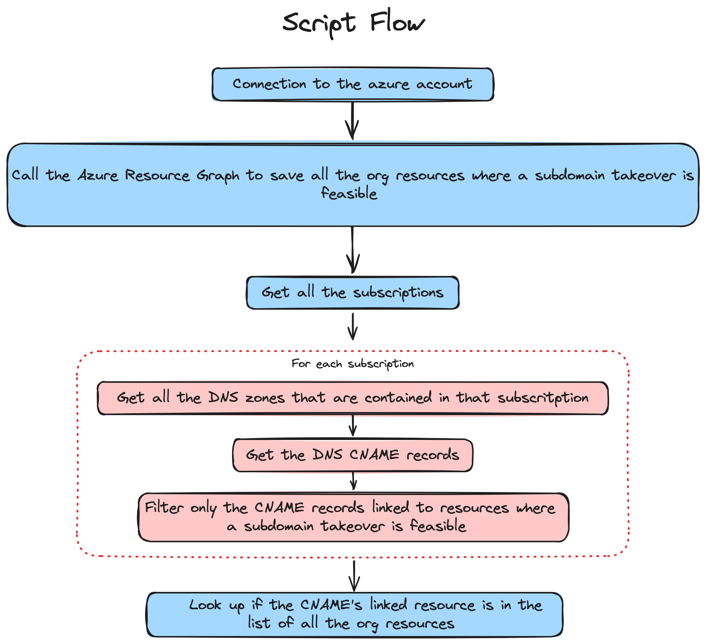

# Subdomain Takeover Monitoring

## Project Overview

The **Subdomain Takeover Monitoring** project aims to detect and prevent potential subdomain takeovers, a critical security vulnerability where attackers exploit abandoned or misconfigured subdomains to gain unauthorized control. This vulnerability can lead to severe risks such as phishing attacks or unauthorized access. Effective DNS management and timely subdomain decommissioning are crucial to mitigate these security threats.

## Repository Structure

```
subdomain-takeover-monitoring/
├── cmd/
│   ├── azure/      # Golang scripts for Azure Lambda function
│   └── aws/        # Golang scripts for AWS Lambda function (not yet implemented)
└── infra/          # Terraform code for infrastructure setup
```

The repository is organized into two main parts:

- **cmd folder**: Contains Golang scripts used for Lambda functions.
  - `azure/`: Scripts for the Azure Lambda function.
  - `aws/`: Planned scripts for the AWS Lambda function (yet to be implemented).

- **infra folder**: Includes Terraform scripts for setting up necessary infrastructure.

## Components and Infrastructure

The current implementation focuses on Azure resources:

Here there is the logic flow of the implementation:



The **subdomain takeover monitoring** solution involves continuous monitoring of DNS records and identification of potential vulnerabilities in subdomains associated with Azure resources.


_NOTE: The AWS part is planned but not yet implemented._

