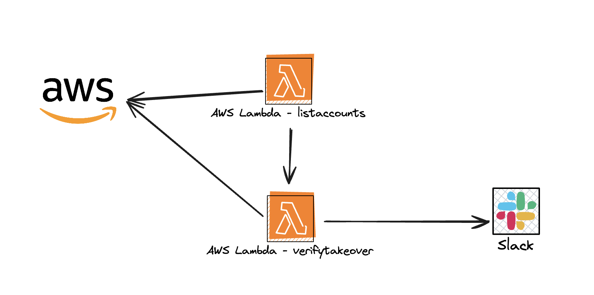

# Subdomain Takeover Monitoring
 
## Project Overview

The **Subdomain Takeover Monitoring** to detect and prevent potential subdomain takeover, a critical security vulnerability where attackers exploit abandoned or misconfigured subdomains. This vulnerability can cause serious risks, such as phishing attacks or data theft. Effective DNS management and timely deactivation of subdomains are critical to mitigating these threats.

## Repository Structure

The repository is organized into two main directories:

  - **`cmd/`**: Contains the Golang source code for the Lambda functions.
      - **`aws/`**: Scripts for AWS Lambda functions.
      - **`azure/`**: Scripts for Azure Lambda functions.
  - **`infra/`**: Contains **Terraform** scripts for deploying the necessary cloud infrastructure.

-----

## Prerequisites

Before you can deploy this application, you'll need to build the Golang binaries. After cloning the repository, run the following commands in your terminal:

```bash
# Build the Azure Lambda function binary and copy the query file
GOOS=linux GOARCH=arm64 CGO_ENABLED=0 go build -o ./infra/tf_generated_azure/src/bootstrap ./cmd/azure/azure.go && cp ./assets/img/queries/query_azure ./infra/tf_generated_azure/src/query
 
# Build the AWS List Accounts Lambda function binary
GOOS=linux GOARCH=arm64 CGO_ENABLED=0 go build -o ./infra/tf_generated_aws_list-lambda/src/bootstrap ./cmd/aws/list-lambda/list-lambda.go
 
# Build the AWS Verify Takeover Lambda function binary
GOOS=linux GOARCH=arm64 CGO_ENABLED=0 go build -o ./infra/tf_generated_aws_verify-takeover/src/bootstrap ./cmd/aws/verify-takeover/verify-takeover.go
```
-----

## Components and Infrastructure

This solution leverages cloud-native services to monitor DNS records across different providers. It includes specific implementations for both **AWS** and **Azure** to cover a wide range of cloud environments.

### Subdomain Takeover Monitoring - Azure Implementation

This part of the solution focuses on detecting vulnerabilities in Azure resources.


The core of this implementation is a single **AWS Lambda function** that uses an Azure **Service Principal** to query data from Azure Resource Manager (ARM) and Azure Resource Graph Explorer. If the function identifies a vulnerable resource, it sends an alert to a designated Slack channel.

#### Required Permissions

For the Azure implementation, the Lambda function needs a **Service Principal** with the following permissions to query the Azure Resource Manager and Resource Graph APIs:

```json
"Microsoft.Network/dnsZones/*/read",
"Microsoft.Network/frontDoors/read",
"Microsoft.Storage/storageAccounts/read",
"Microsoft.Cdn/profiles/read",
"Microsoft.Cdn/profiles/endpoints/read",
"Microsoft.Cdn/profiles/customdomains/read",
"Microsoft.Cdn/profiles/endpoints/customdomains/read",
"Microsoft.Cdn/profiles/afdendpoints/read",
"Microsoft.Network/trafficManagerProfiles/read",
"Microsoft.Network/publicIPAddresses/read",
"Microsoft.ContainerInstance/containerGroups/read",
"Microsoft.ApiManagement/service/read",
"Microsoft.Web/sites/Read",
"Microsoft.Web/sites/slots/Read",
"Microsoft.ClassicCompute/domainNames/read",
"Microsoft.ClassicStorage/storageAccounts/read"
```


### Subdomain Takeover Monitoring - AWS Implementation

This part handles the detection of subdomain takeover vulnerabilities within an AWS environment, especially for organizations with multiple AWS accounts.



This implementation uses a two-Lambda approach:

1.  **List Accounts Lambda**: Gathers a list of all AWS accounts within an organization.
2.  **Verify Takeover Lambda**: Retrieves DNS and resource data from each listed account to check for vulnerable resources.

If a vulnerable resource is found, an alert is sent to a **Slack** channel, similar to the Azure implementation.

#### Required Permissions

To implement the AWS solution, you must configure the following **IAM roles**:

1.  **For the `listaccounts` function**: Create an IAM role with `organizations:ListAccounts` permission to be assumed by the Lambda function.
2.  **For the `verifytakeover` function**: Create a custom IAM role in **each** account within your organization with read permissions on **Route 53 Hosted Zones** and **S3 buckets**. This role will be assumed by the Lambda function to scan for vulnerabilities.